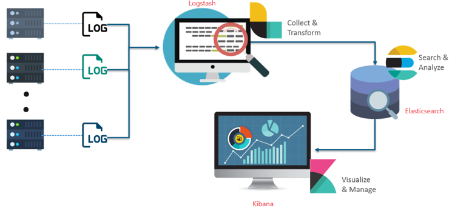

---

## Elasticsearch란?
- 아파치 루씬(정보 검색 라이브러리 오픈 소스 소프트웨어)기반의 Java 오픈소스 분산 검색 엔진
- 데이터를 인덱싱하여 저장, 검색, 집계 등의 기능 수행
- 일종의 NoSQL로 분류할 수 있음

### 특징 및 장점
- inverted index로 실시간에 준하는 빠른 검색 속도
- RESTful 방식의 API 제공
    - 인덱스 관리 API
    - 문서 관리 API
    - 검색 API
    - 집계 API
- Schemaless
- 확장성
- RDBMS에서 다루기 어려운 full text search 기능 제공
- 다양한 plug-in을 이용하여 한국어 기반의 형태소 기반 자연어 처리 가능
- Multi Tenancy 제공
    - 인덱스가 달라도(RDB로 치면 DB가 달라도) field명만 같으면 검색 가능
- inverted index 제공 (MongoDB, Cassandra 등의 일반적인 NoSQL은 지원 안함)

### 단점
- Real-Time X
- 트랜잭션, 롤백 지원 X
- 데이터 업데이트 제공 X
    - 업데이트를 하는 것처럼 보이지만 사실은 기존 document를 삭제하고 재생성하는 것임

### [index vs inverted index](https://steady-coding.tistory.com/581) 
- index 방식 (RDBMS)
    - `목차`처럼 문서에서 키워드를 찾아 보기 쉽도록 정렬 및 나열한 목록
    - B+Tree 자료 구조로 search 구현
- inverted index 방식 (Elasticsearch)
    - 키워드를 통해서 문서를 찾아내는 방식
    - 책의 맨 뒤에 있는 `찾아보기`와 같은 기능
    - 검색 성능이 매우 빠르다.
    - FST(Finite State Transducer), Posting List, Skip List 등 다양한 자료구조를 혼합해서 inverted index search 구현

## ELK 스택?
- E(Elasticsearch)
    - 데이터를 검색 및 집계하여 필요한 정보 획득
- L(Logstash)
    - 다양한 소스의 로그 또는 트랜잭션 데이터를 수집, 집계, 전처리하여 Elasticsearch에 전달
- K(Kibana)
    -  데이터 시각화 및 모니터링

- 사용 사례: 주로 로드밸런싱 되어 있는 WAS 서버의 흩어져 있는 로그를 한 곳으로 모으고, 원하는 데이터를 빠르게 검색한 뒤 시각화하여 모니터링 하기 위해 사용한다.

## Elasticsearch와 RDBMS의 비교
### 용어 비교
1. |RDBMS|Elaticsearch|
    |------|---|
    |schema|mapping|
    |database|index|
    |partition|shard|
    |table|type|
    |row|document|
    |column|field|

2. |RDBMS SQL|Elaticsearch HTTP Method|
    |------|---|
    |SELECT|GET|
    |INSERT|PUT|
    |UPDATE, SELECT|POST|
    |DELETE|DELETE|
3. node / shard
- node: 클러스터 내의 단일 서버 인스턴스
- shard: 데이터가 shard 단위로 분할 됨

정리: 데이터를 shard 단위로 나누어 각 node에 저장

## GiftHub에서의 Opensearch 구축 과정
- 본 프로젝트는 AWS의 Elasticsearch인 Opensearch를 사용하였다.
    - 생성시 자동으로 자동으로 dashboard를 생성해준다. (Kibana 별도 설치 X)
    - 별도의 plug-in 설치를 못한다. (nori tokenizer를 사용하려 했는데, 설치가 안되서 못함)
    - [Elasticsearch vs Opensearch](https://sematext.com/blog/opensearch-vs-elasticsearch-which-one-is-better-sematext/#final-remarks)
    - 빠르게 구축 하고, 기본 검색 기능만을 개발하는 현재 수준에서 Opensearch가 더 맞는 서비스일 것이라고 생각하여 Opensearch 선택
- product indexing
    - AWS Lambda를 이용하여 RDS의 데이터를 Opensearch에 indexing
- tokenizer 설정
    - 시도 1: seunjeon tokenizer
    - 시도 2: ngram tokenizer
- query문 결정
    - 시도 1: MLT 쿼리
    - 시도 2: match 쿼리

### 시도 1
- seunjeon korean tokenizer
- 동의어를 이용해 금액권에 대한 처리 시도
- index할 때의 tokenizer와 search 할 때의 tokenizer를 다르게 둘 수 있음
```json
PUT /producttest
{
  "settings": {
    "analysis": {
      "tokenizer": {
        "seunjeon": {
          "type": "seunjeon_tokenizer",
          "decompound": "true",
          "index_eojeol":"true"
        }
      },
      "filter": {
        "my_synonym": {
          "type": "synonym",
          "synonyms": [
            "T, Tall, t",
            "R, Regular, REGULAR, r",
            "아이스, ICE, ice",
            "20\\,000,2만,20000",
            "10\\,000,1만,10000",
            "30\\,000,3만,30000",
            "50\\,000,5만,50000",
            "100\\,000,10만,100000"
        ]
        },
        "my_stopwords":{
          "type":"stop",
          "stopwords":["T","Tall","TALL"]
        }
      },
      "analyzer": {
        "korean": {
          "type": "custom",
          "tokenizer": "seunjeon",
          "filter": ["lowercase", "trim"]
        },
        "korean_search": {
          "type": "custom",
          "tokenizer": "seunjeon",
          "filter": ["lowercase","my_stopwords", "my_synonym", "trim"]
        }
      }
    }
  },
  "mappings": {
    "properties": {
      "product_name": {
        "type": "text",
        "analyzer": "korean",
        "search_analyzer": "korean_search"
      },
      "brand_name": {
        "type": "text",
        "analyzer": "korean",
        "search_analyzer": "korean_search"
      },
      "brand_id": {
        "type": "integer"
      },
      "product_id": {
        "type": "integer"
      }
    }
  }
}
```
### 시도 2
- ngram tokenizer
- `상품권 50,000원` 검색시 `0`의 개수가 많아서 score 값이 이상함 ➡️ `50,000원` -> `5만원`으로 전처리하는 과정을 넣어 해결
- `brand name`을 `keyword`로 검색하여 반드시 `brand name`이 일치하는 경우에만 `product name`을 검색하도록 query문을 작성함
``` json
PUT product
{
  "settings": {
    "analysis": {
      "analyzer": {
        "my_analyzer": {
          "tokenizer": "my_tokenizer"
        }
      },
      "tokenizer": {
        "my_tokenizer": {
          "type": "ngram",
          "min_gram": 2,
          "max_gram": 2,
          "token_chars": [
            "letter",
            "digit"
          ]
        }
      }
    }
  },
  "mappings": {
    "properties": {
      "product_name": {
        "type": "text",
        "analyzer": "my_analyzer",
        "search_analyzer": "my_analyzer",
        "fields": {
          "keyword": {
            "type": "keyword"
          }
        }
      },
      "brand_name": {
        "type": "text",
        "analyzer": "my_analyzer",
        "search_analyzer": "my_analyzer",
        "fields": {
          "keyword": {
            "type": "keyword"
          }
        }
      },
      "brand_id": {
        "type": "integer"
      },
      "product_id": {
        "type": "integer"
      }
    }
  }
}
```

```json
{
  "query": {
    "bool": {
      "filter": [
        {
          "term": {
            "brand_name.keyword": "%s"
          }
        }
      ],
      "must": [
        {
          "match": {
            "product_name": "%s"
          }
        }
      ]
    }
  }
}
```

## 다음 이야기
- Elasticsearch의 다양한 tokenizer와 token filter, RESTful API에 대해 다루겠다!

## 참고 자료
- https://jaemunbro.medium.com/elastic-search-%EA%B8%B0%EC%B4%88-%EC%8A%A4%ED%84%B0%EB%94%94-ff01870094f0
- https://velog.io/@sung-ik-je/ElasticSearch
- https://djlee118.tistory.com/47
- https://velog.io/@koo8624/Database-Elastic-Search-1%ED%8E%B8-%EC%97%AD%EC%83%89%EC%9D%B8Inverted-Index%EA%B3%BC-%ED%98%95%ED%83%9C%EC%86%8C-%EB%B6%84%EC%84%9D